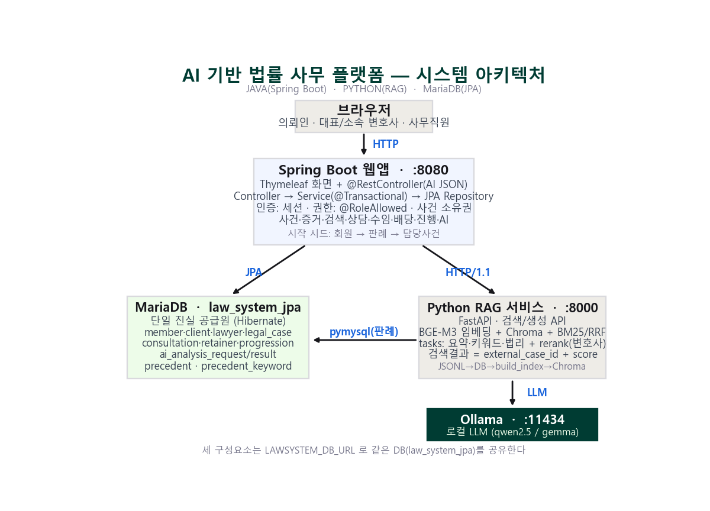

# AI 기반 법률 사무 플랫폼

사건 수임·관리 워크플로우와 **판례 RAG · LLM**을 결합한 법률 사무 통합 웹 플랫폼.
분산프로그래밍1 과제 — 웹(Java) · AI(Python) · DB · LLM을 **독립 프로세스**로 구성한 3-tier 시스템.



> 전체 설계는 [`docs/ARCHITECTURE.md`](docs/ARCHITECTURE.md), RAG 상세는 [`docs/RAG_통합정리.md`](docs/RAG_통합정리.md) 참고.

---

## 📦 저장소 구조

```
law-platform/
├── web/    Spring Boot 웹앱 (사건·증거·변호사검색·상담·수임·진행상황·AI 연동)
├── rag/    Python RAG 서비스 (FastAPI · BGE-M3 · Chroma · BM25/RRF · Ollama 연동)
└── docs/   아키텍처 문서 · 다이어그램 · 발표자료
```

| 구성요소 | 런타임 | 포트 | 역할 |
|---|---|---|---|
| `web/` | Spring Boot 3.3 (Java 17) | `:8080` | 화면(Thymeleaf) + 업무 로직 + JPA |
| `rag/` | FastAPI / uvicorn (Python 3.13) | `:8000` | 판례 검색·요약·키워드·법리 분석 |
| Ollama | 로컬 LLM 서버 | `:11434` | qwen2.5 / gemma 등 |
| MariaDB | `law_system_jpa` | `:3306` | 단일 진실 공급원 (별도 PC 가능) |

세 구성요소는 환경변수 **`LAWSYSTEM_DB_URL`** 로 같은 DB를 공유한다.

---
## 클래스 설계의 Entity 반영 (설계 ↔ 구현 대응)

중간레포트 **클래스 다이어그램(4장)** 의 도메인 클래스는 모두 JPA `@Entity`(`lawSystem.jpa.entity` 패키지)로 구현되어, Hibernate가 `law_system_jpa` 스키마로 매핑한다. 즉 설계의 클래스·속성·관계가 코드의 엔티티에 1:1로 반영되어 있다.

### 1. 상속 구조 (Generalization → JPA JOINED 상속)
```
Member (추상, @Inheritance(strategy = JOINED), PK member_id)
 ├─ Client
 ├─ Lawyer (추상)
 │    ├─ PartnerLawyer
 │    └─ AssociateLawyer
 └─ Staff
```
- 클래스 다이어그램의 "Lawyer/Client/Staff → Member", "Partner/Associate → Lawyer" 일반화 관계를 **JOINED 상속**으로 구현(서브타입이 `member_id`를 공유 PK로 사용).

### 2. 설계 클래스 → Entity 매핑

| 설계 클래스(클래스 다이어그램) | JPA Entity | 테이블 | 반영 비고 |
|---|---|---|---|
| Member / Client / Lawyer / PartnerLawyer / AssociateLawyer / Staff | 동일명 Entity | member·client·lawyer·partner_lawyer·associate_lawyer·staff | JOINED 상속, `specialty`는 `@ElementCollection` |
| **Case** | **LegalCase** | legal_case | SQL 예약어 `case` 충돌 회피로 개명. client·assignedLawyer를 `@ManyToOne` FK로 |
| CaseInfo | CaseInfo | case_info | 사건 입력 정보 |
| Evidence | Evidence | evidence | LegalCase 1:N |
| CaseDocument | CaseDocument | case_document | LegalCase 1:N |
| SimilarPrecedent | SimilarPrecedent | similar_precedent | LegalCase 1:N |
| ProgressionRecord | ProgressionRecord | progression_record | LegalCase 1:N |
| ConsultationRequest | ConsultationRequest | consultation_request | client·lawyer·schedule FK, `ConsultationStatus` |
| ConsultationSchedule | ConsultationSchedule | consultation_schedule | lawyer FK, `ScheduleStatus` |
| RetainerRequest | RetainerRequest | retainer_request | RetainerCondition 1:N, `RetainerStatus` |
| RetainerCondition | RetainerCondition | retainer_condition | `ConditionStatus` |
| VerificationResult | VerificationResult | verification_result | 본인인증 결과 |
| ElectronicSignature | ElectronicSignature | electronic_signature | 전자서명 |
| AIAnalysisRequest | AIAnalysisRequest | ai_analysis_request | requester(Member) FK, `AnalysisType`·`AIRequestStatus` |
| AIAnalysisResult | AIAnalysisResult | ai_analysis_result | request FK + case_id FK |
| AIAnalysisFunction | AIAnalysisFunction | ai_analysis_function | AI 기능 메타 |
| Precedent (판례 원본) | Precedent | precedent | `external_case_id` UNIQUE — RAG 검색의 역참조 키 |

### 3. 관계(Association·Aggregation) → JPA 매핑
- **Association** (예: Client/Lawyer → RetainerRequest, RetainerRequest → Case, Member → AIAnalysisRequest, Staff → ConsultationRequest/Schedule) → `@ManyToOne` + `@JoinColumn`.
- **Aggregation** (Case의 구성요소: Evidence·CaseDocument·ProgressionRecord·SimilarPrecedent) → `@OneToMany(mappedBy=…, cascade=ALL, orphanRemoval=true)`.
- **요청–결과 종속**(AIAnalysisResult는 AIAnalysisRequest의 일부) → `ai_analysis_result.ai_request_id` NOT NULL FK.

### 4. enum 반영
설계의 상태/유형 enum이 그대로 구현되어 `@Enumerated(EnumType.STRING)`으로 저장된다:
`MemberRole`·`CaseCategory`·`CaseStatus`·`ConsultationStatus`·`ScheduleStatus`·`RetainerStatus`·`ConditionStatus`·`AnalysisType`·`AIRequestStatus`.

### 5. 비고 — AI 기능/결과 계층의 위치
클래스 다이어그램의 AI **기능 클래스**(`CaseSummary`·`SimilarPrecedentsAnalysis`·`LegalRuleAnalysis`·`CaseKeywordsExtract`·`DocumentDraft`·`RecommendLawyers`)와 **결과 타입**(`CaseAnalysisReport`·`LegalRuleAnalysisResult`·`PrecedentAnalysisResult` 등)은 데이터가 아닌 **동작/계산 클래스**이므로, 영속 엔티티가 아니라 도메인 패키지(`lawSystem.ai`)의 클래스로 구현했다. 영속화가 필요한 요청·결과는 `AIAnalysisRequest`/`AIAnalysisResult` **엔티티로 일반화**하여 저장한다.

> 요약: 설계 클래스 다이어그램의 **도메인 클래스 = JPA 엔티티**, **상속 = JOINED**, **관계 = @ManyToOne/@OneToMany**, **상태값 = enum** 으로 빠짐없이 반영되었으며, 유일한 변경은 SQL 예약어 회피를 위한 `Case → LegalCase` 개명이다.

---

## 🛠️ 기술 스택

- **웹**: Spring Boot 3.3 · Spring MVC · Spring Data JPA(Hibernate 6) · Thymeleaf
- **인증/권한**: HttpSession + `LoginInterceptor` + `@RoleAllowed` · BCrypt(spring-security-crypto)
- **AI/RAG**: BGE-M3 임베딩 · Chroma 벡터DB · BM25Okapi · RRF 융합 · Ollama
- **연동**: `java.net.http.HttpClient`(HTTP/1.1 고정) + Jackson ↔ FastAPI · pymysql
- **DB**: MariaDB (JPA가 스키마 권한 `ddl-auto=update`)

---

## ✨ 주요 기능

- **인증·역할 권한**: 의뢰인 / 대표·소속 변호사 / 사무직원, 서버단 강제(`@RoleAllowed`)
- **사건 관리**: 사건 등록 · 증거 업로드 · AI 분석 이력
- **변호사 찾기**: 키워드·전문분야·지역 검색 (사건 키워드 재사용)
- **상담/수임**: 상태머신 기반 (수임 조건 전달·조정·확정 → `RETAINED`)
- **진행상황 공유/열람**: 변호사 등록 → 의뢰인 열람
- **AI(요청→호출→저장)**: 사건 요약 · 키워드 추출 · 법리 설명(RAG) · 유사판례 검색

---

## 🧠 RAG 동작 원리 (요약)

1. **DB가 원본**(`precedent` 테이블), **Chroma는 검색 인덱스** — 단일 진실 공급원
2. 판례를 `chunk_type`(판시사항·판결요지·참조조문·전문)으로 분할·임베딩
3. 검색 = **Dense(BGE-M3) + Sparse(BM25)** → **RRF(K=60)** 융합 → `case_id` 그룹핑 → 정규화(0~1)
4. 검색 결과는 **식별자+점수만** 반환, 본문은 Java가 DB에서 조립 (근거가 항상 원본)
5. LLM은 Ollama `/api/chat`(`format="json"`), 실패 시 산문 폴백 — **graceful degradation**

---

## 📄 문서

| 파일 | 내용 |
|---|---|
| [`docs/ARCHITECTURE.md`](docs/ARCHITECTURE.md) | 전체 시스템 설계·데이터 모델·역할 매트릭스·시작/종료 절차 |
| [`docs/RAG_통합정리.md`](docs/RAG_통합정리.md) | RAG 파이프라인·검색 알고리즘·API 명세 |
| [`docs/발표자료_초안.md`](docs/발표자료_초안.md) | 발표 슬라이드 초안(기술 심화판, 21장) |
| [`docs/발표_10분_진행안.md`](docs/발표_10분_진행안.md) | 10분 발표 진행안(데모 + 기술스택 + AI 활용법) |
